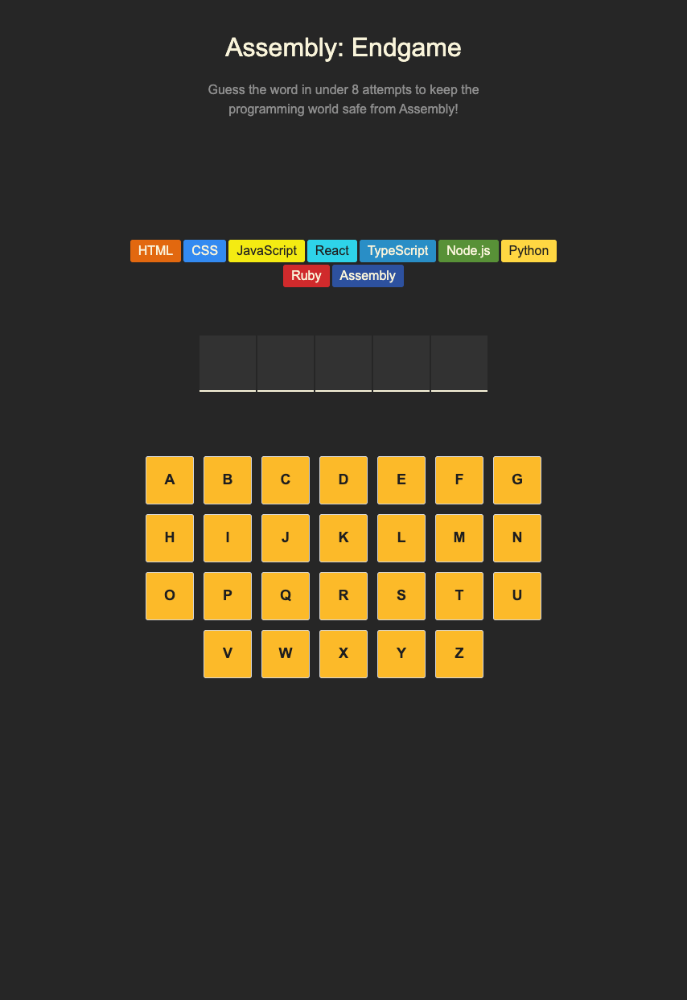
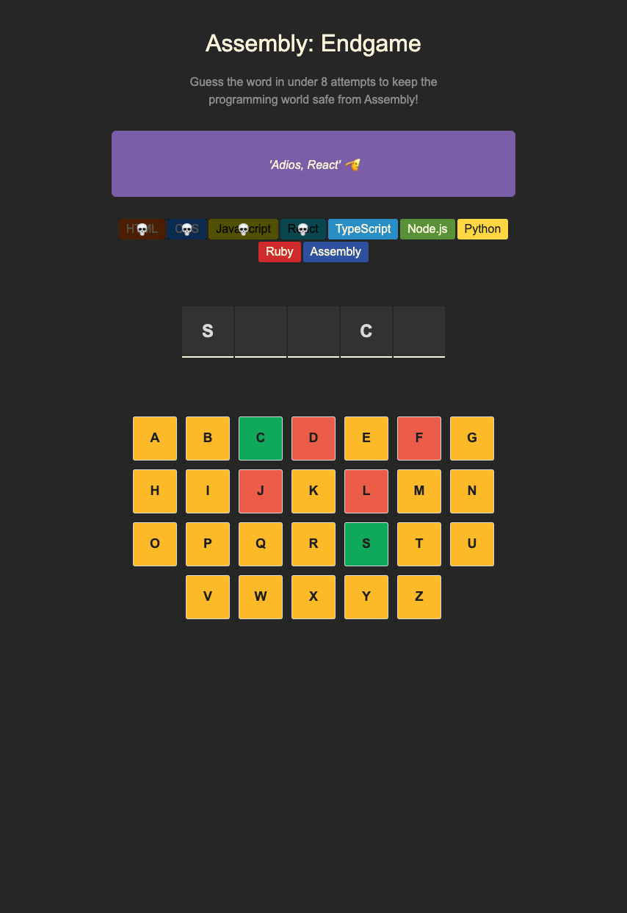
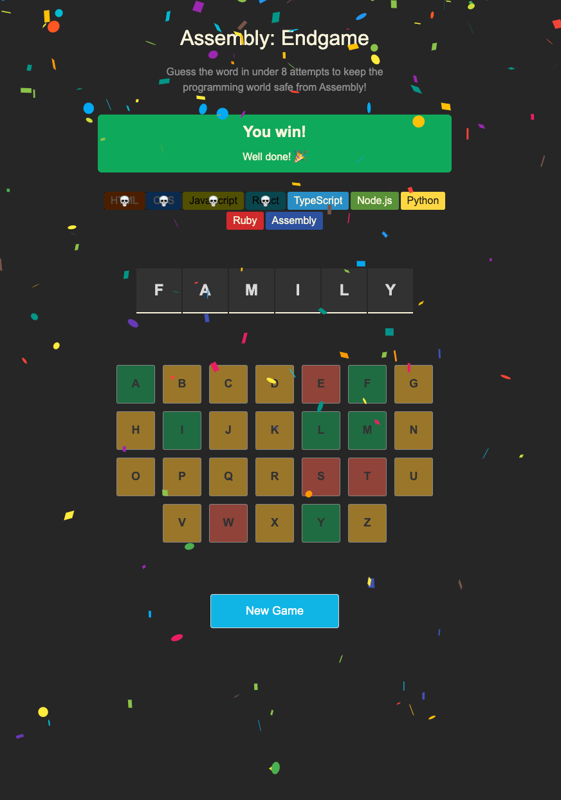
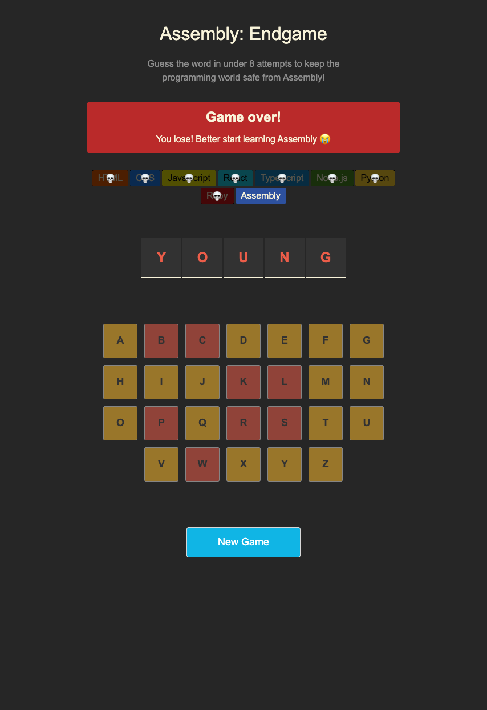

# 🕹️ Assembly: Endgame

A fun and interactive **word guessing game** built with React, where your mission is to guess the hidden programming language in under 8 attempts — or risk the rise of Assembly! 😱

---

## 🚀 Live Demo
[View on Vercel](https://assembly-endgame-ebrar.vercel.app/)

---


## ✨ Features

- 🎯 Guess the hidden programming language within 8 attempts  
- 🔤 Interactive alphabet buttons with correct/incorrect highlights  
- 📱 Responsive design  
- 🛡️ Accessibility support with ARIA attributes  
- 💥 Dynamic game-over states and visual feedback  

---

## 🛠️ Built With

- **React** – UI framework
- **Vite** – Fast development environment
- **CSS3** – Custom styling
- **JavaScript (ES6+)** – Game logic

---

## 📦 Installation & Setup

1. **Clone the repository**
```bash
git clone https://github.com/YOUR_USERNAME/assembly-endgame.git
```

2. **Navigate into the project**
```bash
cd assembly-endgame
```

3. **Install dependencies**
```bash
npm install
```

4. **Run the development server**
```bash
npm run dev
```

---

## 📂 Project Structure

```
assembly-endgame/
├── public/
│   └── abc.png
├── src/
│   ├── assets/
│   ├── components/
│   │   ├── Header.jsx
│   │   ├── Languages.jsx
│   ├── App.css
│   ├── App.jsx
│   ├── index.css
│   ├── main.jsx
│   ├── utils.js
│   ├── words.js
│   └── languages.js
├── .gitignore
├── index.html
├── package.json
├── vite.config.js
└── README.md
```

---

## 🎮 How to Play

1. Click or tap the letters to guess the hidden programming language.
2. You have **8 attempts** before Assembly takes over.
3. Correct letters are revealed; incorrect guesses are marked.
4. Press "New Game" to try again.

---

## 📸 Screenshots

<table>
  <tr>
    <th>Start Screen</th>
    <th>Mid Game</th>
  </tr>
  <tr>
    <td></td>
    <td></td>
  </tr>
  <tr>
    <th>Winning Screen</th>
    <th>Losing Screen</th>
  </tr>
  <tr>
    <td></td>
    <td></td>
  </tr>
</table>
